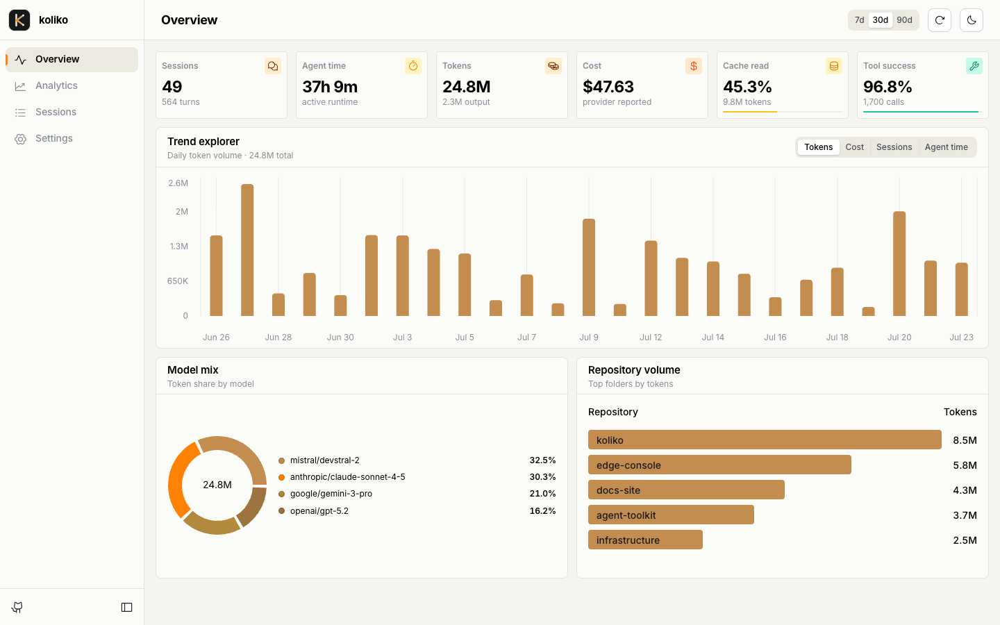
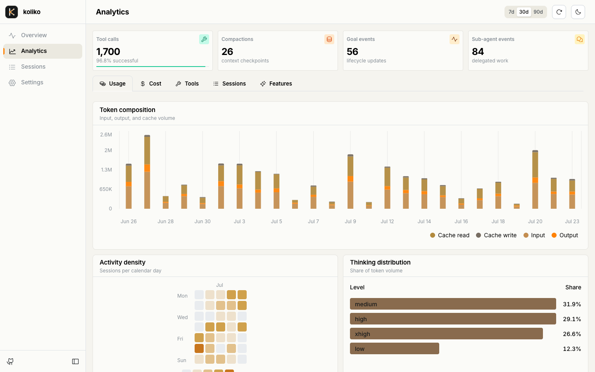

# Koliko

Self-hostable usage analytics for coding agents.

Koliko shows where agent time and tokens go without collecting the work itself. It tracks sessions, models, token usage, provider-reported cost, tools, context compaction, goals, and delegated work. Pi is the first supported collector; the ingestion protocol is agent-agnostic.

## Highlights

- Usage, cost, cache, tool, session, and feature analytics
- Breakdowns by model, thinking level, and repository folder name
- Passkey-only dashboard access and revocable ingestion keys
- Durable local spooling for offline and failed deliveries
- Cloudflare Workers, Static Assets, and D1 deployment

## Dashboard

### Overview



### Analytics



## Data boundary

| Collected | Never collected |
| --- | --- |
| Session and runtime identifiers | Prompts or responses |
| Repository folder name | Source code or file contents |
| Provider, model, and thinking level | Reasoning content |
| Token counts and provider-reported cost | Tool arguments, output, or command text |
| Tool name, duration, and error status | File names or absolute paths |
| Compaction and lifecycle counters | Git remotes |

Unknown event fields are removed at the schema boundary. See [Privacy](docs/privacy.md) for the complete contract and its operational limits.

## How it works

```text
Pi lifecycle events
        |
        v
0600 local JSONL spool
        |
        | HTTPS + bearer ingestion key
        v
Cloudflare Worker --- React dashboard
        |
        v
       D1
```

See [Architecture](docs/architecture.md) for request flows, authentication boundaries, metric definitions, and the data model.

## Deploy

[](https://deploy.workers.cloudflare.com/?url=https://github.com/angristan/koliko)

Cloudflare creates a repository in your Git account, provisions D1, configures Workers Builds, and deploys Koliko. Choose the final hostname and generate the required secrets before registering the first passkey.

Read [Self-hosting and operations](docs/self-hosting.md) for Deploy Button configuration, custom domains, manual deployment, upgrades, backups, and recovery.

## Connect Pi

Create an ingestion key from the deployed dashboard's **Settings** page, then install the collector:

```bash
pi install git:github.com/angristan/koliko
```

Create `~/.pi/agent/koliko/config.json` and protect it:

```json
{
  "baseUrl": "https://koliko.example.com",
  "apiKey": "klk_..."
}
```

```bash
chmod 600 ~/.pi/agent/koliko/config.json
```

Reload Pi with `/reload`, then check delivery with `/koliko-status` and `/koliko-flush`. Tracking starts with the next session; Koliko does not backfill existing sessions.

See [Pi collector](docs/pi-collector.md) for configuration, event mapping, queue behavior, updates, and troubleshooting.

## Documentation

- [Architecture and metrics](docs/architecture.md)
- [Privacy](docs/privacy.md)
- [Pi collector](docs/pi-collector.md)
- [Self-hosting and operations](docs/self-hosting.md)
- [Development](docs/development.md)

## License

[MIT](LICENSE)
